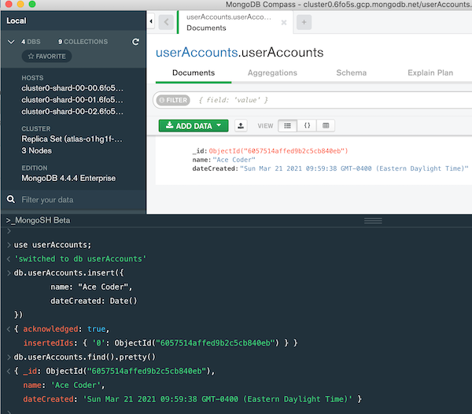

# Week 10A Notes (10/26/21)

## I. Express Handlebars
- Review [Express Handlebars Demo/HW](https://github.com/tonethar/IGME-430-Spring-2020/blob/master/notes/express-handlebars-demo.md)

<hr>

## II. MongoDB
- [MongoDB - Intro to mongo shell](https://github.com/tonethar/IGME-430-Spring-2020/blob/master/notes/mongo-shell-intro.md):
  - This isn't too hard, but you need to get your Mongo cloud account set up ASAP - look for the **MongoDBCloudSetup** PDF in myCourses and follow the instructions

<hr>

## III. MongoDB demo

- Pretty much doing the same demo covered above - but I will be using MongoDB Compass instead of Terminal 

<hr>

## IV. Database Study Guide
- See myCourses for dropbox, Study Guide DOC, and link to video

<a id="mongo-cloud" />

<hr>

## V. Getting your MongoDB Cloud Account Working

- I am putting you into breakout groups (so please help each other out with this!):
  - Everyone needs to get their Mongo cloud account set up (look for the **MongoDBCloudSetup** PDF in myCourses and follow the instructions) 
  - Then complete the following:

1) In the MongoDB Compass application, in the console at the bottom (you will have to click the **\_MongoSH Beta** text/button, type in the following statements, one at a time (make sure that you substitute your actual name for "Ace Coder"):

```js
use userAccounts;

db.userAccounts.insert({
	name: "Ace Coder",
	dateCreated: Date()
})

db.userAccounts.find().pretty()
```

<hr>

2) Take a screenshot of this session - it should look something like this (except with the current date, and with your name instead of "Ace Coder"):



<hr>

3) Upload this screenshot to the dropbox


<hr><hr>

| <-- Previous Unit | Home | Next Unit -->
| --- | --- | --- 
| [**Week 9B Notes**](9B.md)   |  [**IGME-430 Home**](../README.md) | [**Week 10B Notes**](10B.md)
